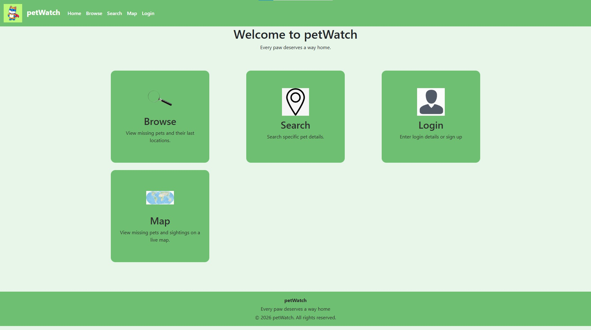
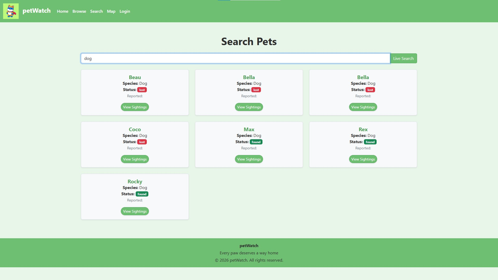
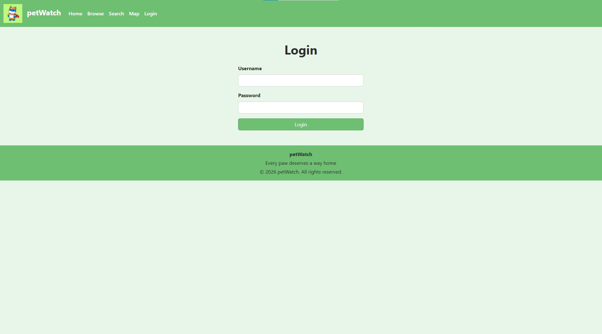
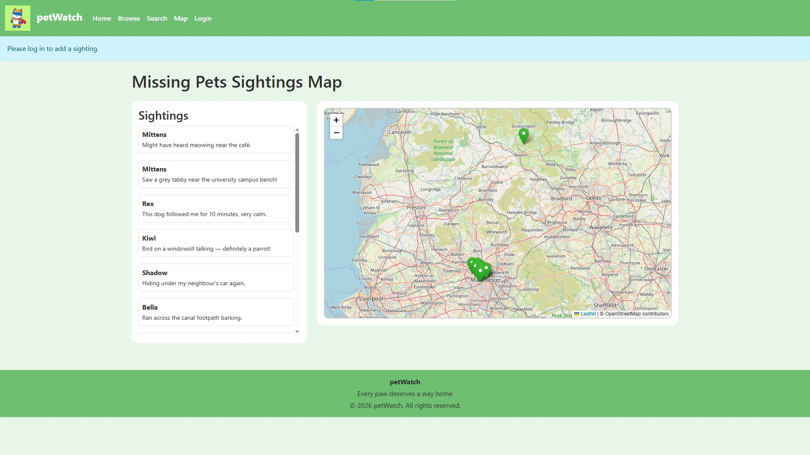
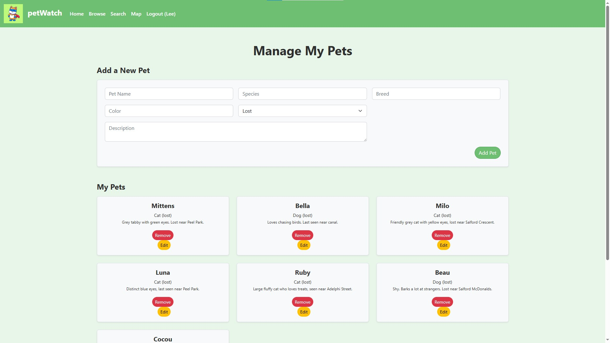

# PetWatch

PetWatch is a web application developed as part of a Client Server Systems module at the University of Salford.

The application allows users to browse pets, report sightings, search for lost pets and view sightings on an interactive map.

---

## Project Overview

PetWatch was developed to help users track and report lost pets. The application provides functionality for browsing pet records, searching for pets, submitting sightings and viewing sighting locations on an interactive map.

The project was built using PHP and SQLite and follows an MVC-style architecture to separate application logic, data handling and user interfaces.

---

## Features

* User authentication and login
* Pet browsing and searching
* Lost pet reporting
* Sighting management
* Interactive map integration using Leaflet
* SQLite database integration
* MVC-based project structure
* Session management
* Administrative pet management

---

## Technologies Used

### Backend

* PHP
* SQLite

### Frontend

* HTML
* CSS
* JavaScript

### Additional Tools

* Leaflet Maps
* Poseidon Hosting Environment

---

## Architecture

The application follows an MVC-style architecture:

### Models

Responsible for database interactions and business logic.

### Views

Responsible for presenting information to users through the interface.

### Controllers

Responsible for processing requests and coordinating communication between models and views.

---

## Screenshots

### Home Page

### Search Pets

### Login Page

### Interactive Map

### Management Dashboard

---

## What I Learned

* Full-stack web development
* Database design using SQLite
* Authentication and session management
* CRUD operations
* MVC architecture principles
* PHP web application development
* Interactive map integration using Leaflet
* Deploying and managing web applications

---

## Future Improvements

* Enhanced user interface and user experience
* Email notifications for reported sightings
* Improved filtering and search functionality
* User profile management
* Mobile responsive redesign

---

## Author

**David Lawal**

Software Engineering Student
University of Salford

GitHub: https://github.com/david-lawal
